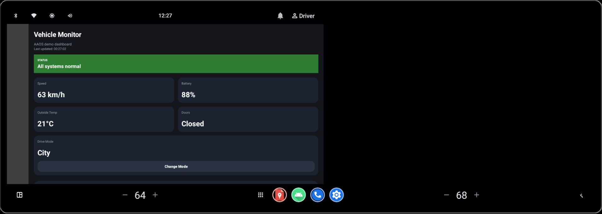
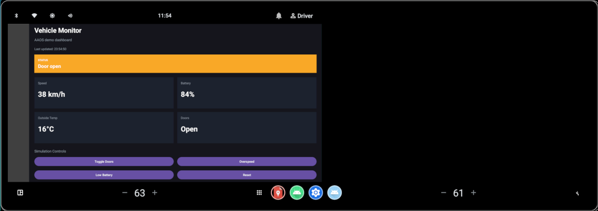
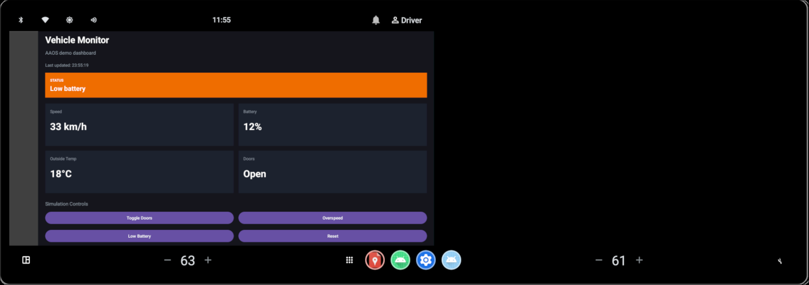
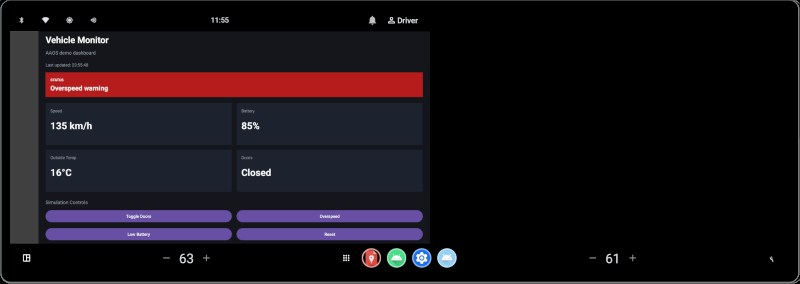
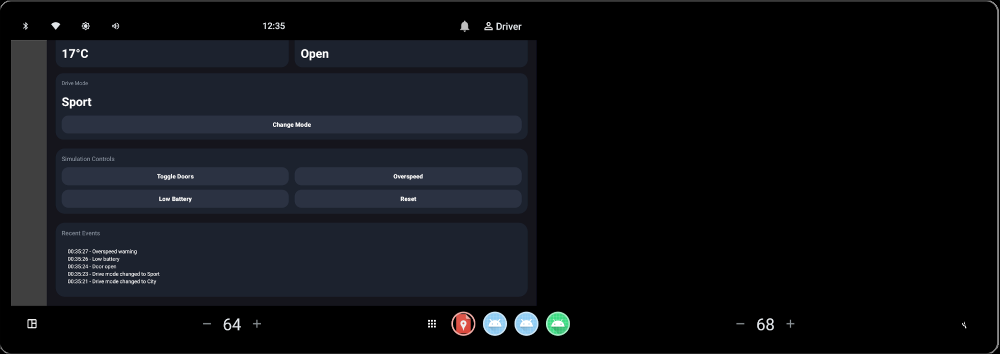

# AAOS Vehicle Monitor

A simple **Android Automotive OS (AAOS)** demo dashboard built with **Kotlin + XML Views**.

This project was created to explore **automotive HMI concepts** using the **AAOS emulator**, without requiring real vehicle hardware or CAN integration.

## Features

- Real-time simulated vehicle status updates
- Dashboard cards for:
  - Speed
  - Battery
  - Outside temperature
  - Door state
  -  Drive mode
- Status banner with visual alerts:
  - All systems normal
  - Door open
  - Low battery
  - Overspeed warning
- Manual simulation controls:
  - Change drive mode
  - Toggle doors
  - Trigger overspeed
  - Trigger low battery
  - Reset state
- Recent events / alert log
- "Last updated" timestamp

## Tech stack

- **Android Automotive OS emulator**
- **Kotlin**
- **XML Views**
- **Android Studio**

## Why this project

The goal of this project was to build a small but presentable **AAOS prototype**, focusing on:

- fast iteration
- emulator-based development
- automotive-style UI
- simple simulation logic
- no external hardware dependencies

## Screenshots

### Normal state

### Door open warning

### Low battery warning

### Overspeed warning

### Controls and recent rvents

## How it works

The app uses a small in-memory `VehicleRepository` to simulate changing vehicle data over time.

A periodic UI refresh updates the dashboard with:
- random telemetry changes
- forced states triggered by manual buttons
- drive mode changes
- alert color changes depending on severity
- event history updates when the dashboard state changes

This makes it easy to demonstrate the app in the AAOS emulator without relying on real vehicle APIs.

## Running the project

### Requirements

- Android Studio
- Android SDK
- Android Emulator
- Android Automotive OS system image installed in SDK Manager

### Steps

1. Open the project in **Android Studio**
2. Create or start an **Android Automotive OS emulator**
3. Run the app with the **Play** button
4. Use the simulation controls to trigger different dashboard states

## Automotive note

This is a **UI/demo prototype** for Android Automotive OS.

It does **not** currently integrate with:
- Vehicle HAL
- `CarHardwareManager`
- CAN bus
- real ECU data

All vehicle signals are currently **mocked/simulated** for demonstration purposes.

## Repository description

**AAOS demo dashboard built with Kotlin and XML for Android Automotive OS, featuring simulated vehicle telemetry, drive modes, event history and manual test controls.**

## Topics

`aaos` `android-automotive` `android-automotive-os` `android` `kotlin` `xml` `dashboard` `automotive` `hmi` `vehicle-simulator`
